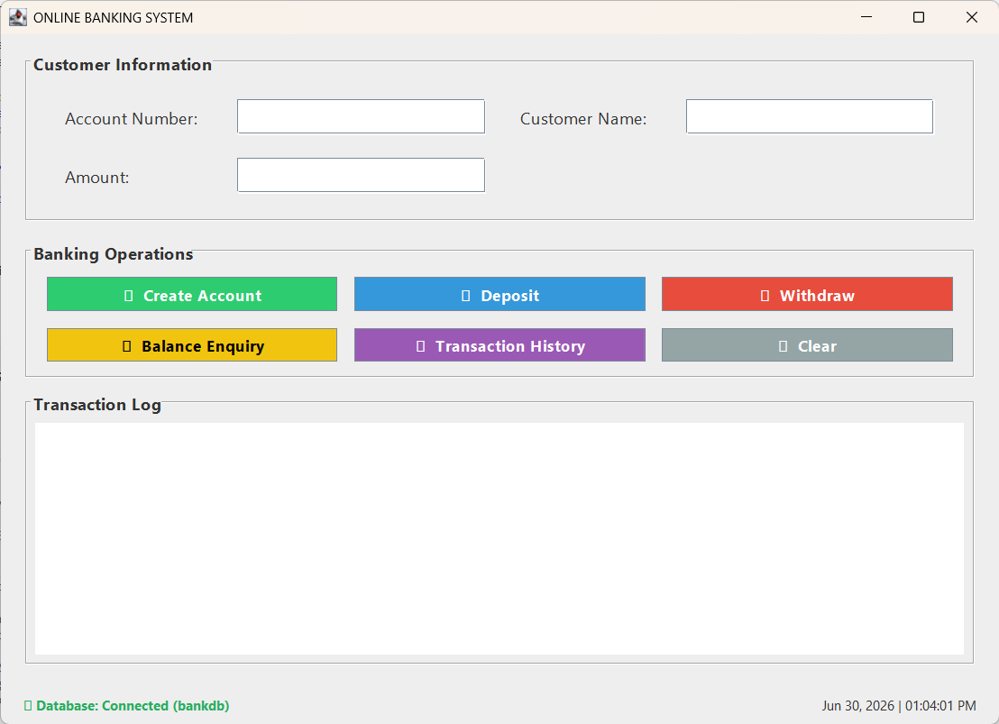
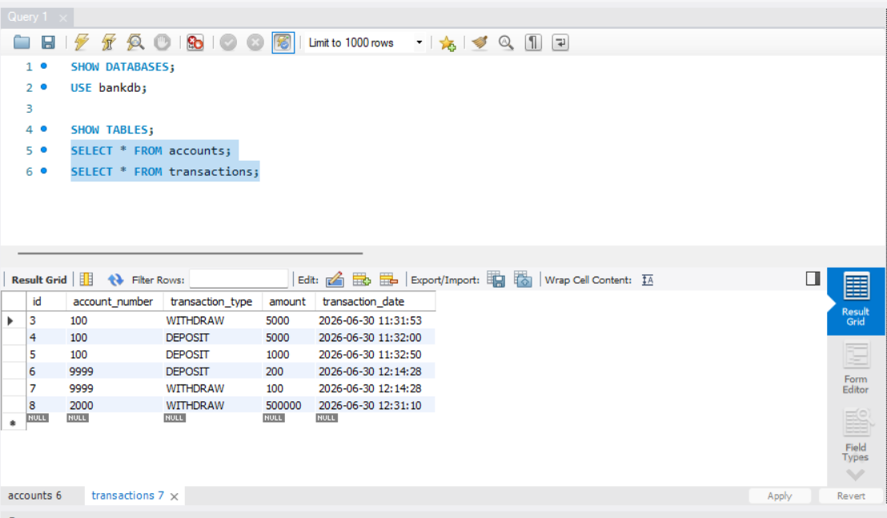

# 🏦 Online Banking System

A desktop-based **Online Banking System** developed using **Java Swing**, **JDBC**, and **MySQL**. The application allows users to create bank accounts, perform deposits and withdrawals, check account balances, and view transaction history through an intuitive graphical interface.

---

## 📸 Screenshots

### Main Application




### MySQL Database




---

## ✨ Features

- ✅ Create a new bank account
- 💰 Deposit money
- 💸 Withdraw money
- 📊 Check account balance
- 📜 View transaction history
- 🗄️ Data stored permanently in MySQL
- ⚠️ Exception handling for invalid inputs
- 🎨 Modern Java Swing UI using FlatLaf

---

## 🛠️ Technologies Used

| Technology | Purpose |
|------------|---------|
| Java | Programming Language |
| Java Swing | Desktop GUI |
| JDBC | Database Connectivity |
| MySQL | Database |
| FlatLaf | Modern Look & Feel |
| Git | Version Control |

---

# 📂 Project Structure

```
Online-Banking-System
│
├── src
│   └── bank
│       ├── BankAccount.java
│       ├── Transaction.java
│       ├── BankOperations.java
│       ├── BankService.java
│       ├── DatabaseConnection.java
│       ├── BankGUI.java
│       ├── Main.java
│       └── TestRunner.java
│
├── lib
│   ├── mysql-connector-java.jar
│   └── flatlaf-3.4.1.jar
│
├── db_setup.sql
├── README.md
└── LICENSE
```

---

# 🏗️ Architecture

```
           User
             │
             ▼
      Java Swing GUI
             │
             ▼
      BankService.java
             │
             ▼
 DatabaseConnection.java
             │
             ▼
      MySQL Database
```

---

# 🗃️ Database

The project uses **MySQL** with two tables.

### Accounts Table

Stores customer details.

| Column |
|---------|
| Account Number |
| Customer Name |
| Balance |

---

### Transactions Table

Stores every transaction performed.

| Column |
|---------|
| Transaction ID |
| Account Number |
| Transaction Type |
| Amount |
| Date & Time |

---

# 💻 OOP Concepts Implemented

### 🔒 Encapsulation

Private variables with Getter and Setter methods.

Classes:

- BankAccount
- Transaction

---

### 🎯 Abstraction

Implemented using an Interface.

```
BankOperations
```

implemented by

```
BankService
```

---

### 🔄 Polymorphism

Achieved through interface implementation.

```
BankService implements BankOperations
```

---

### ⚠️ Exception Handling

Handles:

- Empty Fields
- Invalid Amount
- Account Not Found
- Insufficient Balance
- Invalid Number Format

---

# ⚙️ How to Run

## 1. Clone Repository

```bash
git clone https://github.com/blessen-thomas/online-banking-system.git
```

---

## 2. Create Database

Run

```
db_setup.sql
```

inside MySQL Workbench.

---

## 3. Update Database Credentials

Open

```
DatabaseConnection.java
```

and change

```java
String username = "root";
String password = "YOUR_PASSWORD";
```

to your MySQL credentials.

---

## 4. Compile

```bash
javac -cp ".;lib/*" -d out src/bank/*.java
```

---

## 5. Run

```bash
java -cp "out;lib/*" bank.Main
```

---

# 📖 How It Works

1. User enters account details.
2. Java Swing sends the request.
3. BankService processes the request.
4. JDBC executes SQL queries.
5. MySQL stores or retrieves data.
6. Results are displayed back in the GUI.

---

# 🚀 Future Improvements

- User Login
- Multiple Account Types
- Fund Transfer
- Interest Calculation
- PDF Statement Export
- Admin Dashboard
- Dark Mode
- JavaFX Version

---

# 👨‍💻 Author

**Blessen Thomas**

Bachelor of Computer Applications (Data Analytics)

Atria Institute of Technology

GitHub:
https://github.com/blessen-thomas

---

